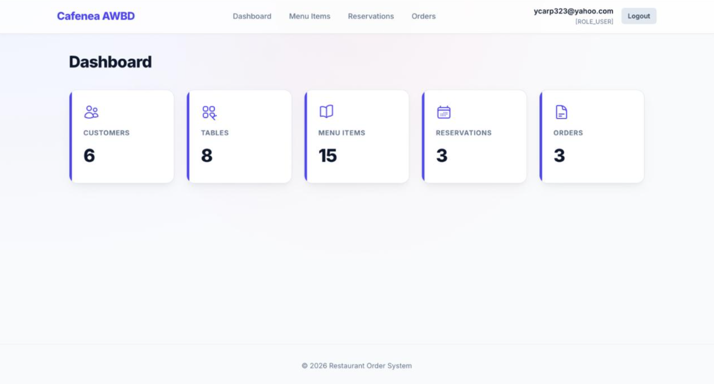
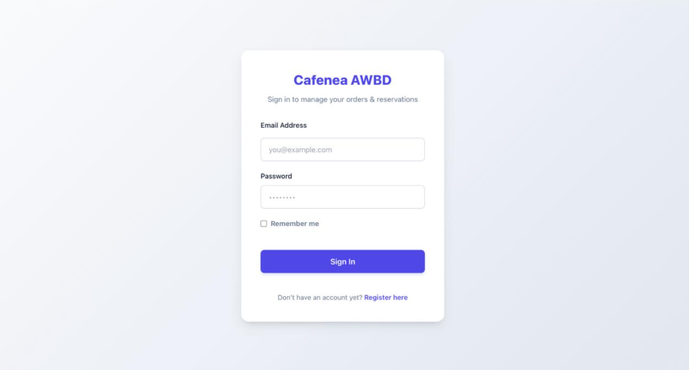
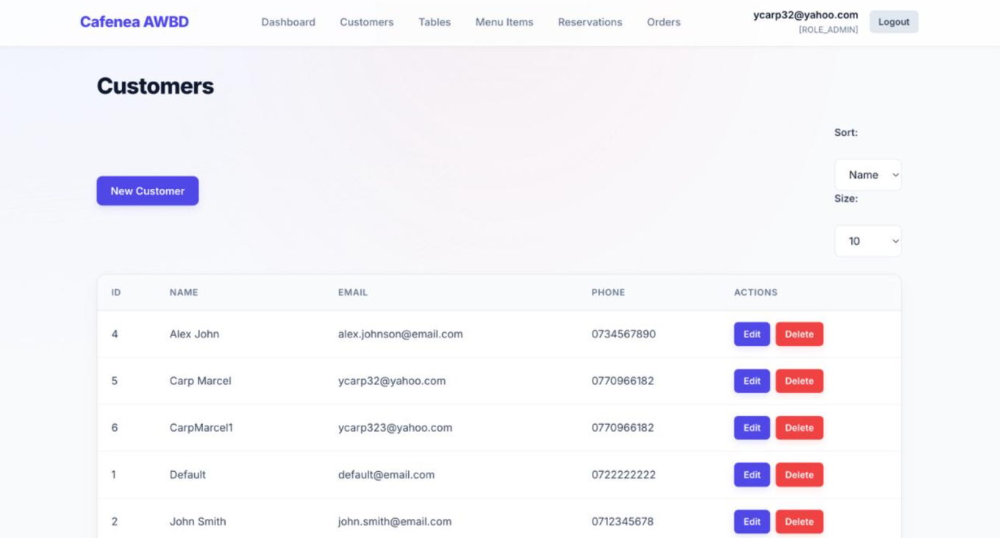
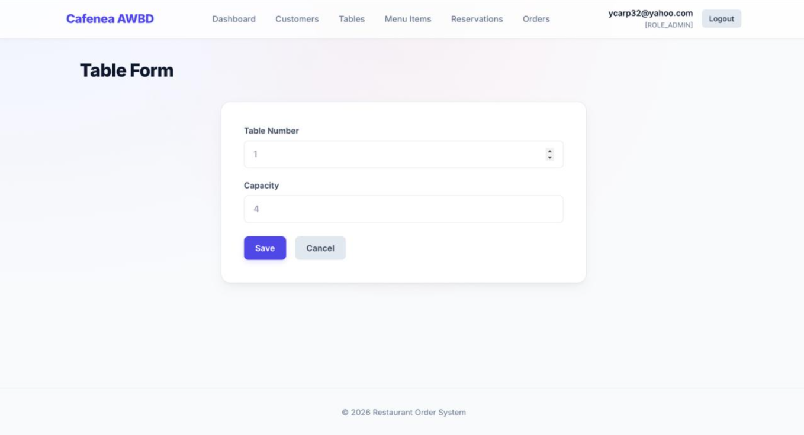
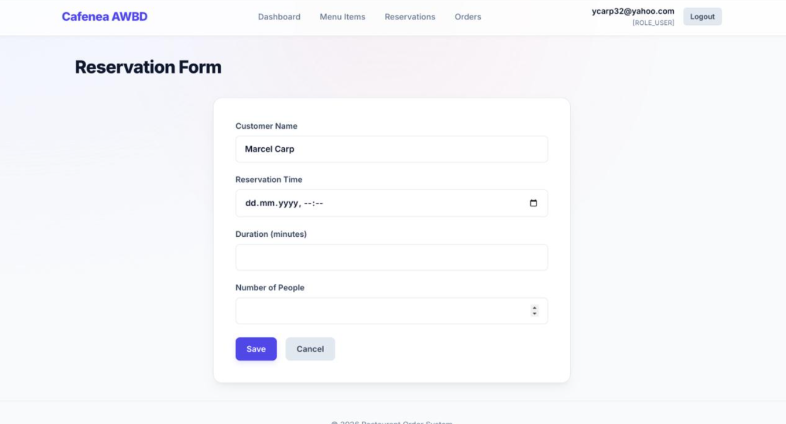
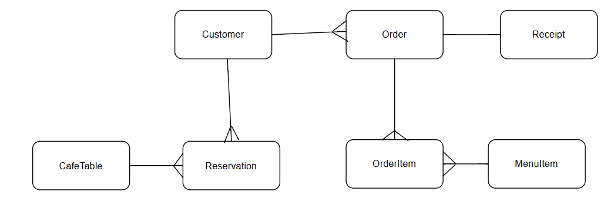

Baza de date: <http://localhost:8080/h2-console> \
Swagger: [http://localhost:8080/swagger-ui/index.html#/](http://localhost:8080/swagger-ui/index.html%23/)

## Business requirements

1.  In calitate de **client**, doresc sa pot avea o experienta personalizata, prin inregistrarea cu nume, email si numar de telefon.

2.  Ca **personal al cafenelei**, doresc sa actualizez in timp real statusul unui produs al meniului.

3.  Ca **personal al cafenelei**, doresc sa consult numarul de mese disponibile, respectiv numarul de scaune per masa.

4.  In calitate de **client**, doresc sa pot crea rezervari tinand cont de data si numarul de persoane.

5.  In calitate de **client**, doresc sa pot vedea produsele si suma totala de plata de pe bon.

6.  Ca **admin**, doresc sa existe un sistem de validare al datelor pentru a evita posibile erori.

7.  Ca **admin**, doresc un sistem simplu si usor de folosit si integrat cu interfata UI .

8.  Ca **personal al cafenelei**, doresc sa adaug/ sterg produse din meniu.

9.  In calitate de **client**, doresc sa pot vedea pret, detalii si statusul produselor din meniu.

10. Ca **personal al cafenelei**, doresc sa adaug/ sterg produse din comanda unui client.


## Descrierea proiectului

Acest proiect este o aplicație web pentru gestionarea unei cafenele. Scopul său este să ofere un sistem complet pentru:

- administrarea meniului și a disponibilității produselor;
- înregistrarea și gestionarea clienților;
- crearea și urmărirea rezervărilor;
- procesarea comenzilor și generarea bonurilor fiscale;
- validare server-side și experiență de utilizare prietenoasă.

Aplicația are un front-end bazat pe Thymeleaf și Tailwind, și un back-end Java Spring Boot cu JPA/Hibernate.

## Arhitectură

Arhitectura aplicației este bazată pe modelul MVC și include următoarele straturi:

- `controller`: expune rutele web și API-urile REST, primește cererile și pregătește modelul pentru vizualizare.
- `service`: implementează logica de business, validările, operațiile CRUD și paginare/sortare.
- `repository`: folosește Spring Data JPA pentru accesul la baza de date.
- `entity`: definește modelul de date pentru clienți, produse, comenzi, rezervări, mese și bonuri.
- `dto`: definește obiecte de transfer pentru input și output.
- `config`: inițializează datele, configurează logging și alte setări ale aplicației.

Componenta de logging este implementată cu SLF4J + Logback, cu:

- niveluri configurate INFO, DEBUG și ERROR;
- fișier principal `logs/app.log`;
- fișier separat pentru erori `logs/error.log`;
- aspect AOP pentru logare automată la intrarea/ieșirea metodelor din straturile de service.

### Tehnologii folosite

- Java 21
- Spring Boot 3.2
- Spring Data JPA
- Hibernate
- Thymeleaf
- Tailwind CSS
- H2 pentru dezvoltare locală
- Maven + npm

## Setup instructions

1. Deschide terminalul și intră în directorul proiectului

2. Instalează dependențele npm pentru Tailwind:

```powershell
npm install
```

3. Construiește fișierul CSS Tailwind:

```powershell
npm run build:css
```

4. Rulează aplicația Spring Boot cu profilul H2:

```powershell
cmd.exe /c ".\mvnw.cmd -Dspring-boot.run.profiles=h2 spring-boot:run"
```

5. Accesează aplicația în browser:

- UI principal: `http://localhost:8080`
- H2 Console: `http://localhost:8080/h2-console`
- Swagger UI: `http://localhost:8080/swagger-ui/index.html#/`

### Parametri utili

- `app.pagination.default-size=10` în `src/main/resources/application.properties`
- `logging.level.org.hibernate.SQL=DEBUG` pentru afișarea interogărilor SQL

## API documentation

### Clienți

- `GET /api/customers` - listează toți clienții
- `GET /api/customers/{id}` - afișează un client după ID
- `POST /api/customers` - creează un client
- `PUT /api/customers/{id}` - actualizează un client
- `DELETE /api/customers/{id}` - șterge un client

### Produse (menu items)

- `GET /api/menu-items` - listează toate produsele
- `GET /api/menu-items/{id}` - afișează produsul cu ID-ul specificat
- `GET /api/menu-items/available` - listează numai produsele disponibile
- `POST /api/menu-items` - adaugă un produs nou
- `PUT /api/menu-items/{id}` - actualizează un produs
- `DELETE /api/menu-items/{id}` - șterge un produs

### Rezervări

- `GET /api/reservations` - listează toate rezervările
- `GET /api/reservations/{id}` - afișează o rezervare
- `POST /api/reservations` - creează o rezervare
- `PUT /api/reservations/{id}/complete` - marchează rezervarea ca finalizată
- `PUT /api/reservations/{id}/cancel` - anulează rezervarea
- `GET /api/reservations/customer/{customerId}` - rezervările unui client

### Comenzi

- `GET /api/orders` - listează comenzile
- `GET /api/orders/{id}` - afișează o comandă
- `POST /api/orders` - creează o comandă
- `PATCH /api/orders/{id}/status` - actualizează statusul comenzii
- `GET /api/orders/customers/{customerId}` - comenzile unui client
- `DELETE /api/orders/{orderId}/items/{orderItemId}` - șterge un item dintr-o comandă

### Mese

- `GET /api/tables` - listează toate mesele
- `GET /api/tables/available` - listează mesele disponibile

## Screenshots
- **Pagina dashboard**


- **Pagina login/register**


- **Pagina clienți**



- **Pagina mese**


- **Pagina rezervări**



## Contribuții membrii echipei

- **Diana** – implementare backend Spring Boot, logare SLF4J/Logback, servicii, paginare și sortare, API-uri, validare, design UI cu Thymeleaf și Tailwind, documentație.
- **Marcel** – gestionare baze de date, migrari, entități JPA, inițializare date, testare, frontend.

## Notă

Proiectul este gândit pentru dezvoltare rapidă și testare locală cu H2. Pentru producție, se poate comuta profilul în `dev` și configura PostgreSQL în `application-dev.properties`.


# ERD

-initial


-final


